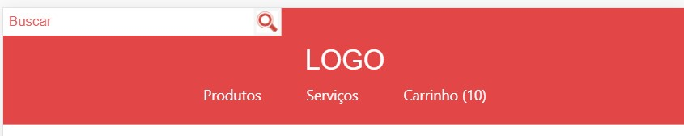

# HTML

É uma linguagem de marcação que tem as seguintes responsabilidades:

-Conteúdo;
-Semântico (tags);
-Estrutura;

- `<h1>` - heading 1 - 6
Usamos ele quando queremos definir títulos;

- `<a>` - Link (a - anchor)
Usamos ela para definir a navegação do usuario. Se você tem um texto que você quer que o usuário clique e ele vá para outro lugar você pode usar essa tag junto com o atributo `href`. Exemplo de um `a` que o usuario é direcionado para o site da collabcode.training:

```
<a href="http://www.collabcode.training">CollabCode.Training</a>    
```

- `<nav>` - Navegação
Utilizamos esta tag para envolver os links da página e assim informar ao navegador que elas tem o valor de navegação. A tag nav foi introduzida no html5 e faz parte das tags semânticas;

- `<header>` - Cabeçalho
Assim com a tag nav a header possui valor semântico também e é responsável em informar que todo o conteúdo dentro dela é referente ao cabeçalho da página.

______
# CSS

É uma linguagem de estilo, isso quer dizer que ela tem as seguintes responsabilidades:

- Visual;
- Refatoração do código;

_Nota: Não é indicado trabalhar com seletores de tag no CSS, o mais indicado é usar classes._


------------
# Projeto Loja Fone

Atualmente estou no desenvolvimento de um projeto que visa construir uma página de internet para a venda de um fone.
Estarei anexando aqui as imagens do progresso deste projeto.

_O projeto pertence ao Marco Bruno da collabcode._

Tela da Loja Fone 08/01/2020


Tela da Loja Fone 12/01/2020


Tela da Loja Fone 15/01/2020


Tela da Loja Fone 16/01/2020


Tela da Loja Fone 16/01/2020 parte 1


Tela da Loja Fone 22/01/2020 


Tela da Loja Fone 29/01/2020 

 


Tela da Loja Fone 30/01/2020 

 

Tela da Loja Fone 02/04/2020 

 

Tela da Loja Fone 10/04/2020 


# LojaFone.github.io
# lojafone.github.io
